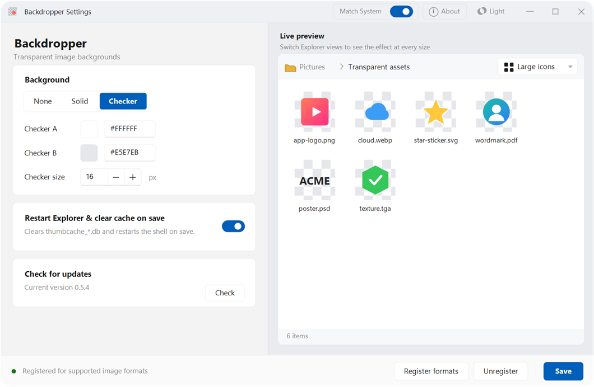
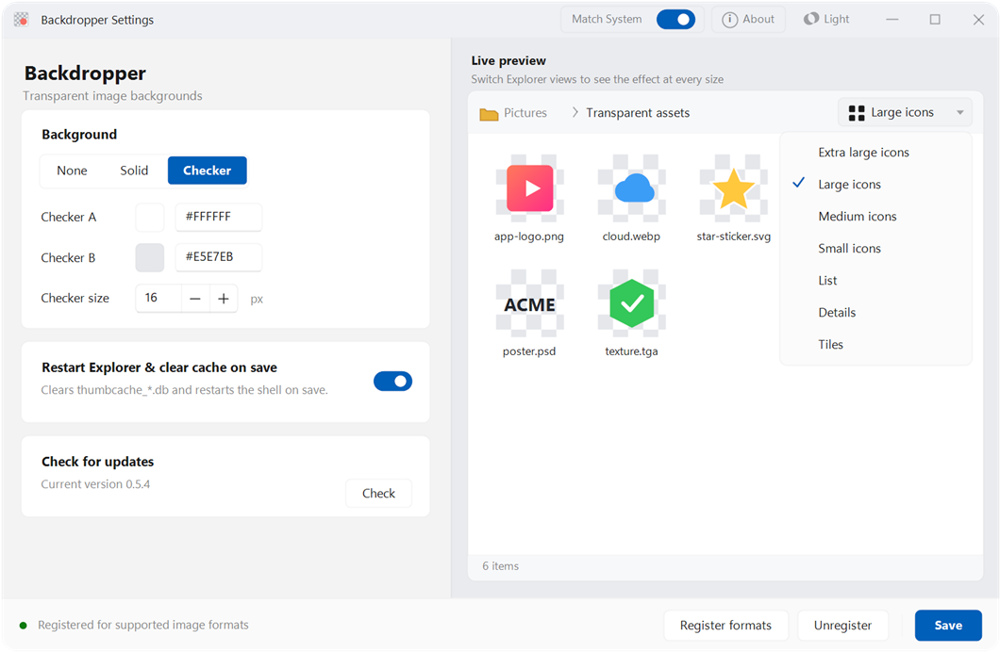
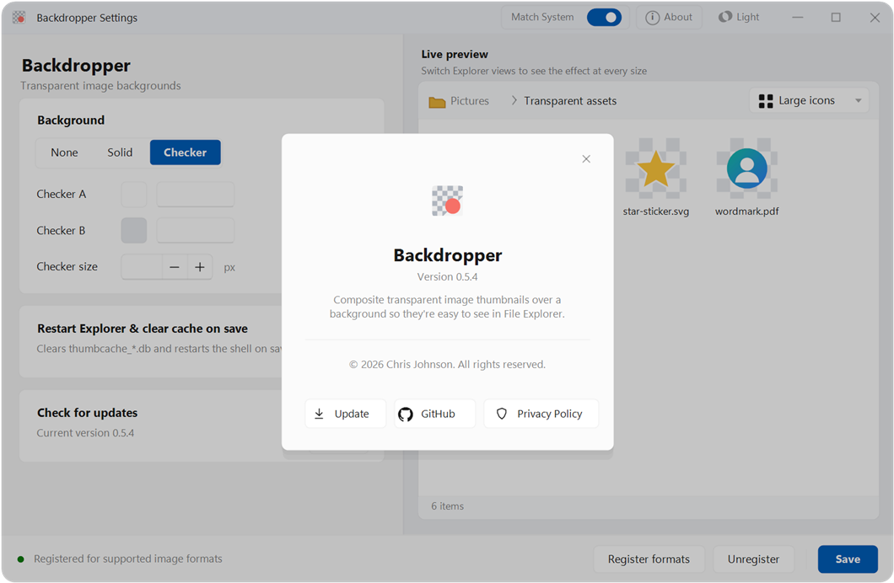

# Backdropper

Native Windows thumbnail utility for transparent images.

Current build: WIC-backed thumbnail handler with native SVG/PDF rendering plus built-in PSD and TGA fallback decoding. It composites transparent thumbnails over a solid/checker/none background in Explorer.

Supported/targeted extensions: `.png`, `.webp`, `.gif`, `.ico`, `.svg`, `.psd`, `.ai`, `.eps`, `.pdf`, `.avif`, `.tga`, `.dds`.

Backdropper registers SVG, PDF, PDF-compatible AI, PSD, and TGA through built-in fallback renderers. EPS/PostScript AI register when Ghostscript is installed. Other formats are registered only when Windows has an installed Windows Imaging Component decoder, so unsupported formats keep their existing Explorer behavior.

[Download latest build](https://github.com/Geijoh/Backdropper/releases/latest) | [Privacy policy](PRIVACY.md)

Use **Check for updates** in the app to check GitHub Releases. When a newer build is available, Backdropper can download the latest Windows x64 build, replace the current files, and relaunch. The install folder must be writable by the current user.

## System Requirements

Runtime:

- Windows 10 or Windows 11 desktop Explorer.
- 64-bit Windows. The thumbnail handler must match Explorer's bitness.
- Per-user registration writes to `HKCU\Software\Classes`; admin rights are not required for the normal dev registration path.
- Settings are stored in `HKCU\Software\Backdropper`.
- Updating from the app requires network access to GitHub Releases and write access to the Backdropper install folder.
- Optional: Ghostscript enables EPS and older PostScript-style AI thumbnails.

Build:

- Visual Studio 2022 Build Tools with Desktop development with C++.
- CMake 3.24 or newer.
- x64 build, matching the commands below.

## Screenshots







Refresh screenshots:

```powershell
.\tools\capture-screenshots.ps1
```

## Build

```powershell
cmake -S . -B build -A x64
cmake --build build --config Release
```

## Test

```powershell
.\build\bin\RenderSmoke.exe
```

## Try in Explorer

```powershell
.\tools\register-dev.ps1
```

Open `build\bin\BackdropperSettings.exe` to change background settings or unregister.

Check the active thumbnail registration:

```powershell
.\tools\check-registration.ps1
```

## Unregister

```powershell
.\tools\unregister-dev.ps1
```

SVG and PDF render through native Windows APIs. PDF-compatible AI uses the same PDF renderer. PSD and TGA have built-in flattened-thumbnail fallback support. EPS and older PostScript-style AI use Ghostscript when installed. AVIF, DDS, and WebP support depends on installed WIC codecs.

## Update Script

Release ZIPs include `BackdropperUpdater.exe`. The app uses this helper for update actions. It downloads the latest release ZIP, waits for the settings app to close, replaces files in-place, and starts Backdropper again. If Explorer has the handler DLL locked, the updater restarts Explorer and retries the replacement.

## Development Note

Backdropper was designed and built with AI-assisted development tools, including Claude Code, Codex, and Claude Design, under maintainer review and direction. The shipped code, packaging, and releases are maintained by Chris Johnson.
